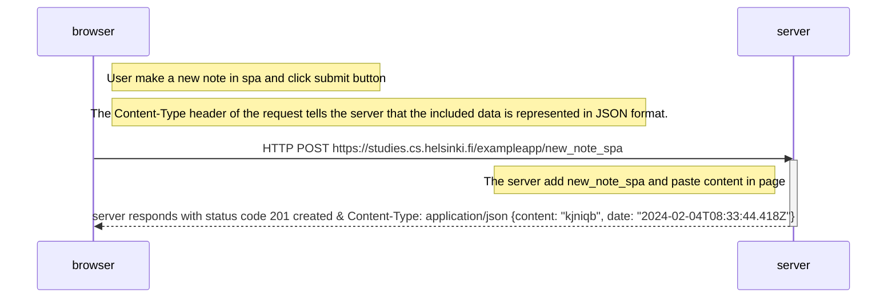

# New note in Single page app diagram

```mermaid
sequenceDiagram
    participant browser
    participant server

    Note right of browser: User make a new note in spa and click submit button
    Note right of browser: The Content-Type header of the request tells the server that the included data is represented in JSON format.

    browser->>server: HTTP POST https://studies.cs.helsinki.fi/exampleapp/new_note_spa
    activate server
     Note left of server: The server add new_note_spa and paste content in page

    server-->>browser: server responds with status code 201 created & Content-Type: application/json {content: "kjniqb", date: "2024-02-04T08:33:44.418Z"}
    deactivate server
```
